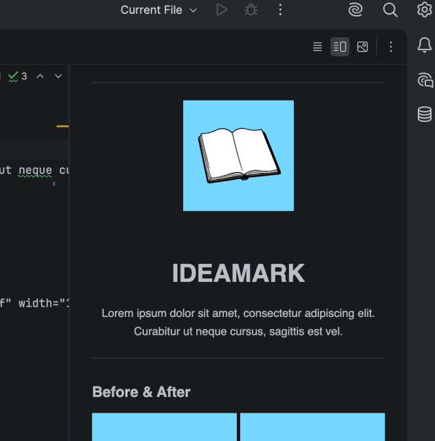
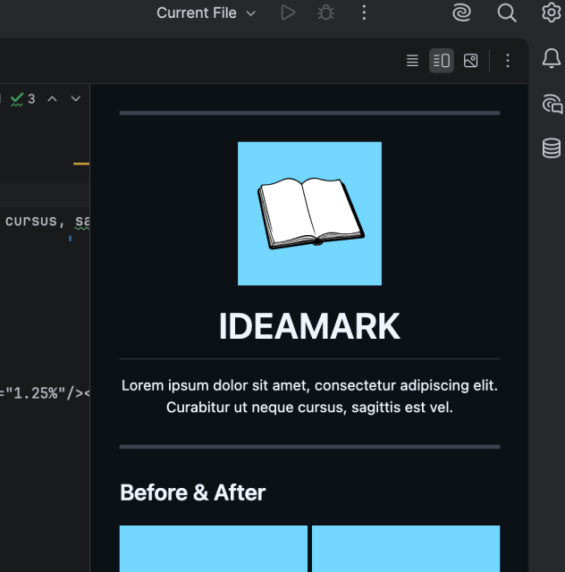

<hr>

<div align="center">
  <p></p>
  <sub>SCRIPTING</sub>
  <h1>IDEAMARK</h1>
  <p>Write Markdown IDE settings for any JetBrains-based editor, appending a custom stylesheet and tuning fonts, spacing, and rendering options to replicate GitHub README rendering as faithfully as possible.</p>
</div>

<hr>

### Before & After

<p></p>

<hr>

### Getting Started

Inside your project, launch this script:

```shell
curl -fsSL https://raw.githubusercontent.com/olankens/ideamark/HEAD/src/ideamark.sh | bash
```

<hr>